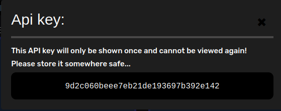

# API

## Authentication
The API is secured via an API key; keys could be requested in the user drop down -> (re)create api key; the following pop-up would show up:


## Usage
Display facilitates a very basic api with 2 endpoints; more details on the API documentation (https://display.berylia.org/api/#):

Get a screenshot:

```sh
curl -k \
-X GET https://display.berylia.org/api/screenshot?display-url=https://siem.int.bob.25.berylia.org \
-H 'Access-Token: <<your_access_token>>'
```

This endpoint will return on success:

```json
{
  "DATA": "<<base64 encoded byte string of a .png>>",
  "URL": "https://siem.int.bob.25.berylia.org"
}
```

create a screenshot:

```sh
curl -k \
-X PUT https://display.berylia.org/api/screenshot \
--form display-url=https://siem.int.bob.25.berylia.org \
-H 'Access-Token: <<your_access_token>>'
```

This endpoint will return on success:

```json
{
  "DATA": "Create new screenshot submitted",
  "URL": "https://siem.int.bob.25.berylia.org"
}
```

## Examples

Example how to save screenshot:

```sh
curl -sk 'https://display.berylia.org/api/screenshot?display-url=https://siem.int.bob.25.berylia.org' \
    -H 'Access-Token: <<your_access_token>>' | jq -r .DATA | base64 -d > screenshot.png
```
