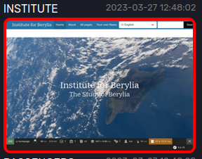
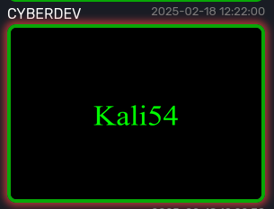
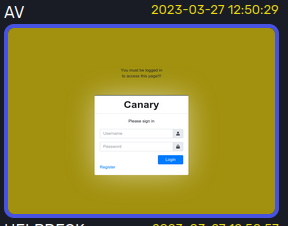
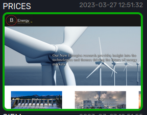
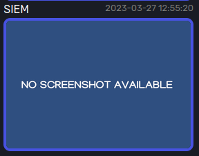

# Overview

## Interval

In its default configuration display will create a new screenshot every 2 to 3 minutes 
(depending on the amount of timeouts...).

## Execution flow

1. Every site will start (when display is deployed) in an empty state. This simply means that there is no screenshot
   on disk;
2. The display daemon distributes these sites over the screenshot nodes (splash or selenium) for screenshotting;
3. Screenshots are returned to the display daemon and processed; the processing will compare the current screenshot
   with the previously made screenshot and will result in a site to be found either in a changed, unchanged or error
   state;
- If **unchanged state**; broadcast results over the websockets to the clients; updating only the time and the 
  visual indicators (image borders);
- If **changed state**; 
  - broadcast results over the websockets to the clients; updating the time, the screenshot and the visual 
    indicators (image borders);
  - create an evidence shot;
  - create timeline entries of previously created evidence and screenshot files;
- If **defaced**;
  - same as **changed** but will also be counted in the defacement chart; which shows the total defacements per team.
- If **error**;
  - broadcast results over the websockets to the clients; updating the time, the screenshot and the visual 
    indicators (image borders);
  - create timeline entries of previously created evidence and screenshot files;   
4. Set changed / unchanged /defaced / error state to current state and use that state in the next iteration.

## Screenshot states

### Changed
When a site is in a changed state; it will be indicated with a red border around the screenshot

### Defaced
When a site is in a defaced state; it will be indicated with a red glowing border around the screenshot

### Unchanged
When a site is in a unchanged state; it will be indicated with either a blue border or a green border around the 
screenshot.

For BT01 - BT24

For BT25 - BT27

### Error
In the error state the following image shall be presented for a given site. This means that the display nodes where 
not able to create a screenshot due to a timeout or any other possible error.

If a site is in an empty state the user will be presented with a similar picture; the only difference in that case 
is that the timestamp shall be set to 'Never'.

The error state could also be the result of a site that was previously in the unchanged state; in this case the above 
image would have a red border
