# Top-Bar

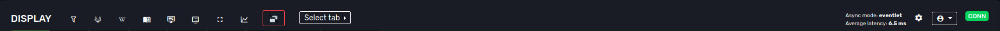

## Filter settings

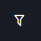
Clicking the filter settings image brings up the display filters

The following screen pops up:

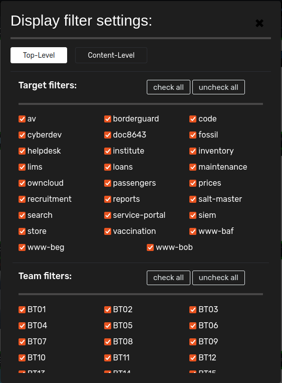

You can choose either:
- Top-Level; these filters control which tabs are visible.
- Content-Level; these filters control which screenshots are displayed **within** the tabs

## Gitlab Issues

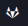
Link to this repo's issue list

## Gitlab Wiki

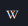
Link to this wiki

## API Documentation

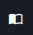
Link to the API documentation of display

## Node status

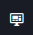
Show the status of the Display-nodes

If clicked; a table with an overview will pop-up which displays the status of the display-nodes and it's workers. 
Each node should have at least two workers; the nodes are responsible for creating the evidence screenshots (selenium).
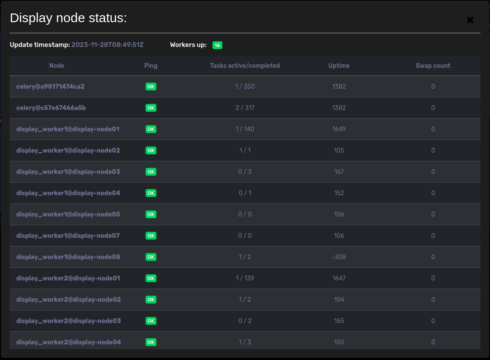

## Display logging

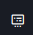
Show the display logging

The display logging will log all changes / actions performed on a given target. It will log screenshots,
evidence shots, timeline actions, state changes and on demand screenshots / evidence shots. It holds this log data
for a rolling window of up to xx minutes (configurable);
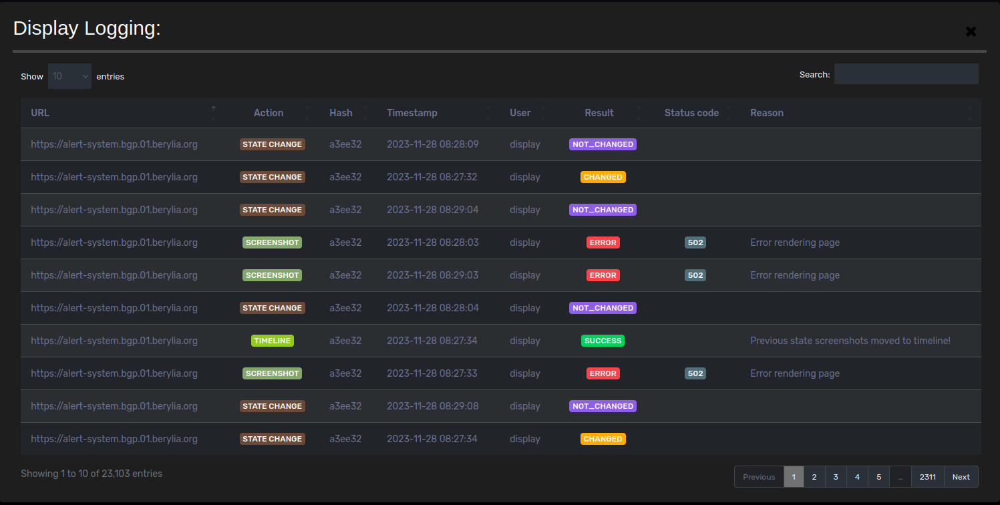

## Tab rotation

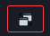

Clicking the tab rotation button enables (green outline) or disables (red outline) tab rotation between all
*visible* tabs. Default rotation timer is set to 90 seconds and is indicated with a countdown timer in the far right
of the Top bar. 

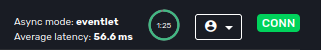

If you would like to change the rotation time; you could click on the countdown timer and a separate popup will allow
you to set the rotation time:
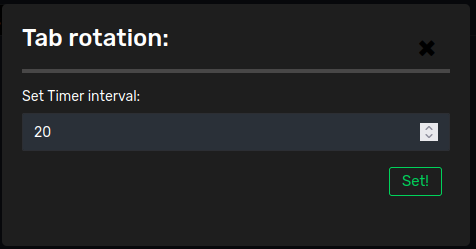

## Select tab
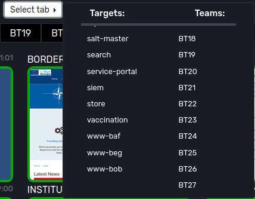

Clicking the select tab button opens up a dropdown menu which let you jump to the selected tab.

## Connection status
The far right section of the top-bar provides the websocket connection details to the server.
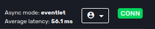

## Admin only section
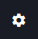
Admin only settings window for displaying options for database management and settings regarding the defacement texts 

## User dropdown
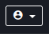
A dropdown with user actions holds the possibility to:
- (re)create an api key;
- logout;
