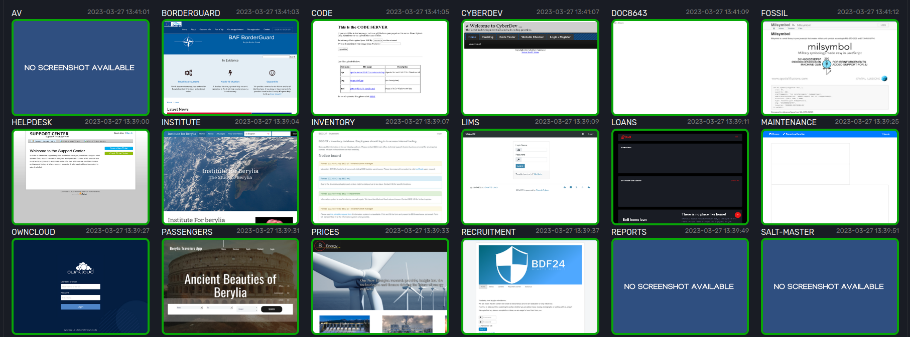
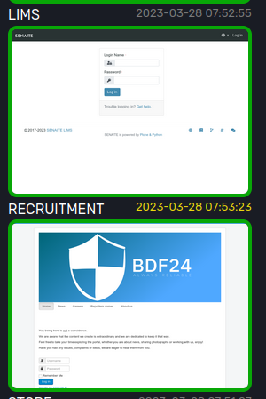
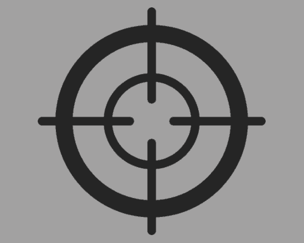
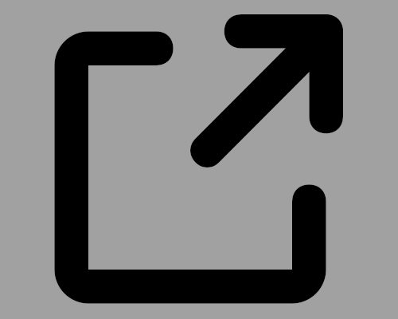
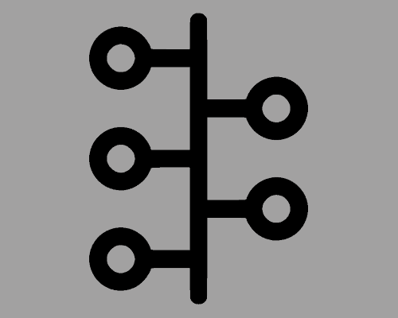
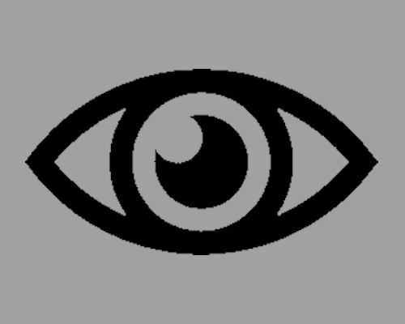
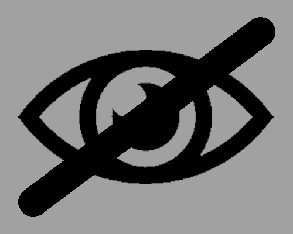
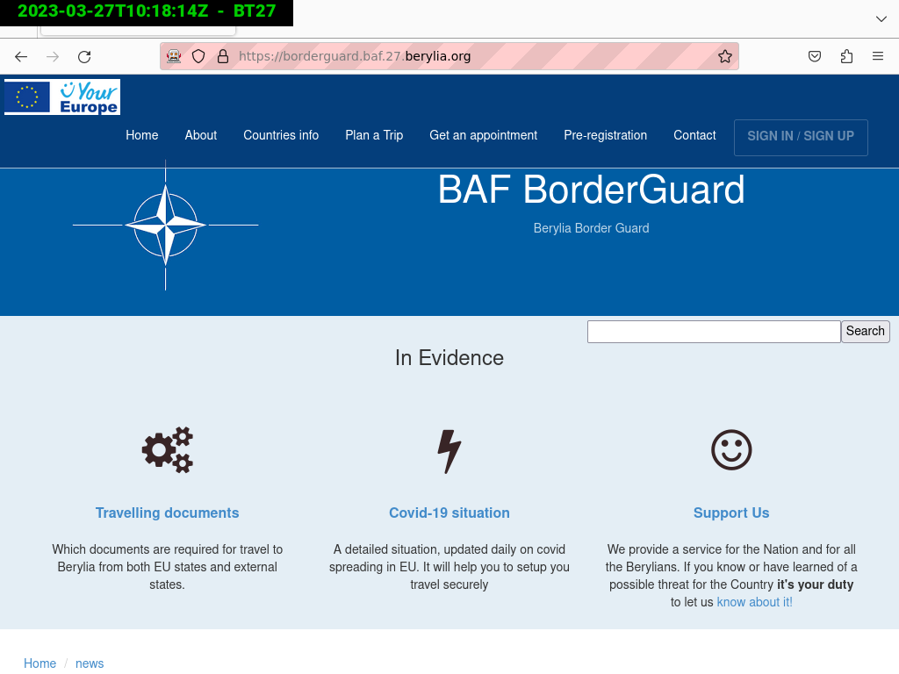
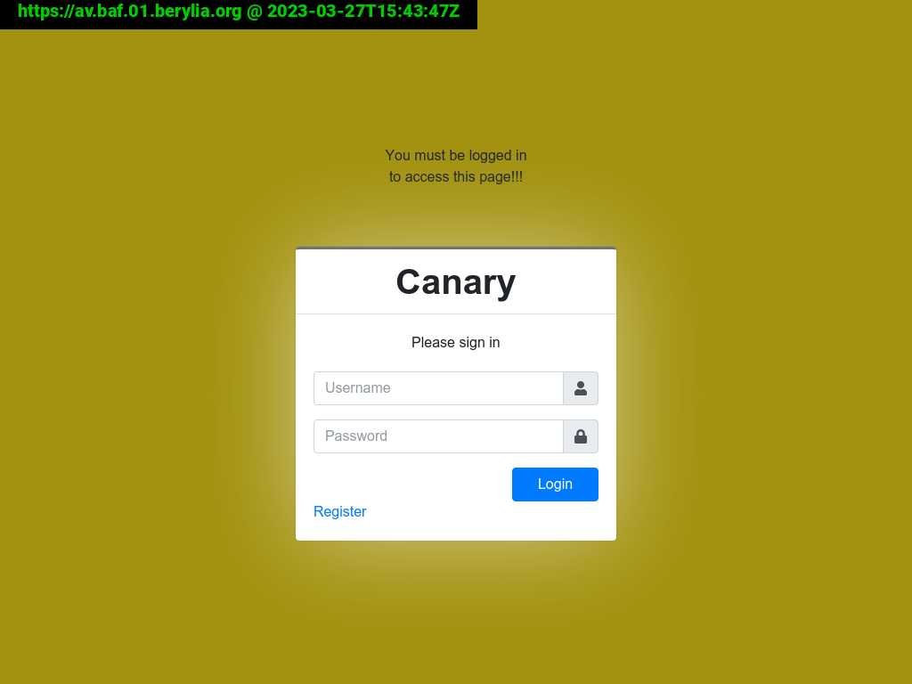

# Content-Section

Zooming in to the grid, you will see that every site has its own tile:

Above every tile there is a description of which site is presented by that tile. There is also a timestamp which
indicates when the last screenshot was taken. The timestamp will light up yellow as a visual indicator when it's
changed and thus a new screenshot is presented in the tile. 

## site actions

### Hover
If you hover over a site screenshot, you can execute different commands on that site:

#### Create a new evidence screenshot;

#### Create a new screenshot on-demand;

#### Open the site url in a new browser tab;

#### Download the latest screenshot / evidence shot;

#### Open the timeline for this site in a new browser tab.

#### Manually set the current screenshot to NOT defaced

#### Manually set the current screenshot to defaced

### Click
if you click a site you will be presented with the last evidence shot
(evidence shots are preferred over 'normal' screenshots) or the last screenshot.

Due to this preference and because evidence shots are only taken on state changes; there is the possibility that the
timestamp of the last screenshot does not match the timestamp of the last evidence shot.

Also note that due to the fact that evidence shots are taken by separate display nodes, it can take up to 30 secs
before the (new) evidence shot is visible / request-able via the display interface / API.

Example evidence shot:

Example screenshot:

